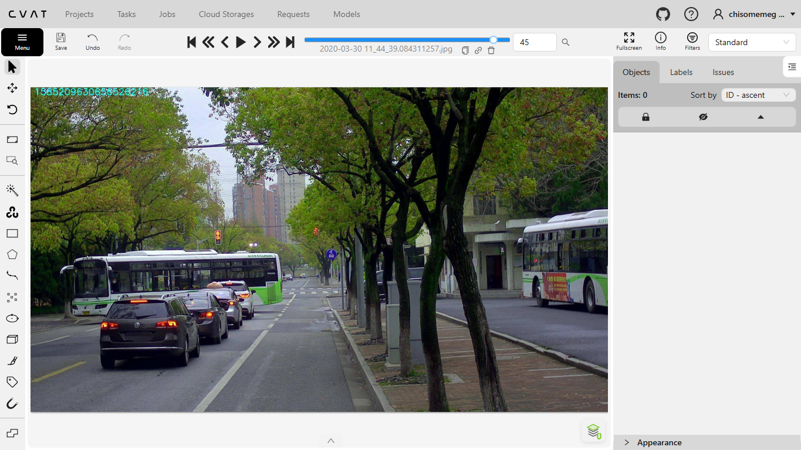
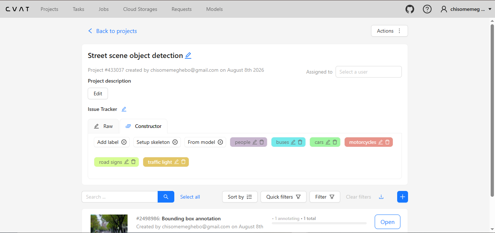
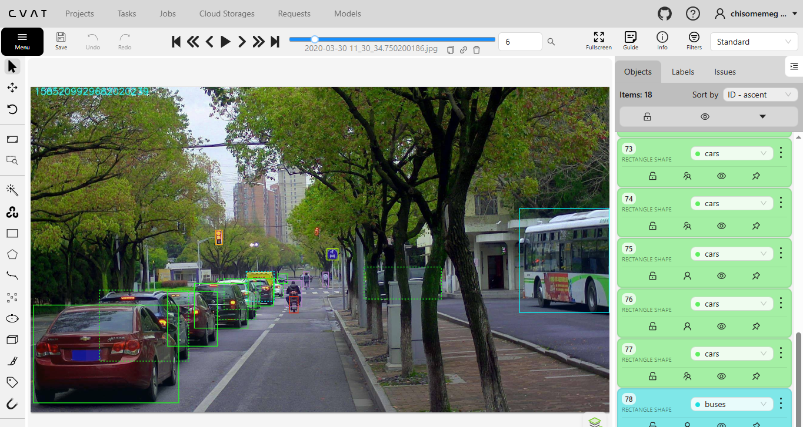
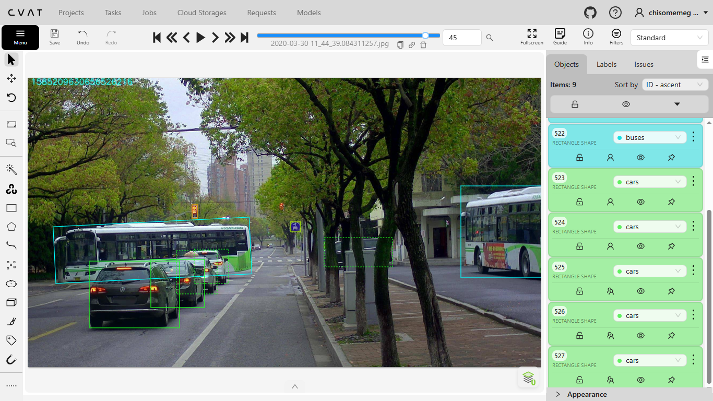
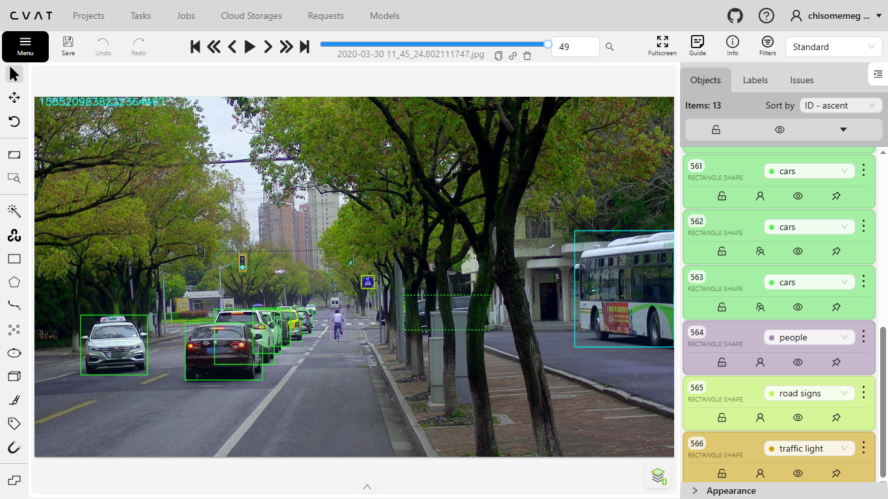

# Street Scene Object Detection

## 1. Project Overview

This project demonstrates a practical image annotation workflow for computer vision using CVAT (Computer Vision Annotation Tool).

The project involved annotating 50 street-scene images by identifying and labeling multiple objects using bounding boxes. The completed annotations were reviewed for accuracy and consistency and exported in both COCO 1.0 and Ultralytics YOLO Detection 1.0 formats.

This project was completed as part of my practical development in AI data annotation and computer vision.

## 2. Project Objective

The objective of this project was to develop practical skills in multi-class image annotation and create accurate, consistent bounding-box annotations for objects commonly found in street scenes.

The project focused on:

- Identifying objects within street-scene images
- Assigning the correct class to each object
- Creating accurate bounding boxes
- Handling partially visible objects
- Maintaining consistent labeling across images
- Reviewing annotations for quality and completeness
- Exporting structured annotation data in industry-used formats

## 3. Dataset

**Dataset:** [Small Traffic Light Dataset XML Format](https://www.kaggle.com/datasets/sovitrath/small-traffic-light-dataset-xml-format)

**Source:** Kaggle

**Images Annotated:** 50

**Original Dataset:** [SJTU Small Traffic Light Dataset (S²TLD)](https://github.com/Thinklab-SJTU/S2TLD)

The images used in this project were obtained from the Small Traffic Light Dataset XML Format available on Kaggle. The dataset is based on the SJTU Small Traffic Light Dataset (S²TLD), an original dataset developed for traffic-light detection and small-object detection. The original S²TLD dataset contains 5,786 images and five traffic-light categories: red, yellow, green, off, and wait-on. :contentReference[oaicite:1]{index=1}

For this project, I selected 50 images from the dataset and created a custom object-detection annotation task using CVAT.

Rather than using the original dataset's annotation categories, I defined a custom set of six classes based on the objects identified in the selected street-scene images:

- People
- Car
- Bus
- Motorcycle
- Road Signs
- Traffic Light

All 50 images were annotated from scratch using bounding boxes. The completed annotations were manually reviewed to identify missed objects, incorrect labels, and loose bounding boxes before being exported in COCO 1.0 and Ultralytics YOLO Detection 1.0 formats.

**Original Dataset License:** MIT License

**Original Dataset Copyright:** Copyright (c) 2018 DetectionTeamUCAS

**Dataset Links:**

- [Kaggle — Small Traffic Light Dataset XML Format](https://www.kaggle.com/datasets/sovitrath/small-traffic-light-dataset-xml-format)
- [Original S²TLD GitHub Repository — Thinklab-SJTU/S2TLD](https://github.com/Thinklab-SJTU/S2TLD)
- [Original S²TLD MIT License](https://github.com/Thinklab-SJTU/S2TLD/blob/master/LICENSE)

## 4. Annotation Tool

**Tool:** CVAT (Computer Vision Annotation Tool)

CVAT was used throughout the annotation workflow to:

- Create the annotation task
- Define label classes
- Annotate objects using bounding boxes
- Review completed annotations
- Correct annotation errors
- Export the completed dataset

## 5. Annotation Type

Annotation Method: Bounding Boxes

Bounding boxes were drawn around identifiable objects within each image and assigned to their corresponding classes.

The objective was to create boxes that closely followed the visible boundaries of each object while maintaining consistent annotation practices across the dataset.

## 6. Classes / Labels

The following six classes were annotated:

- People
- Car
- Bus
- Motorcycle
- Road Signs
- Traffic Light

These classes were selected to represent common road users and traffic-related objects present within the street-scene images.

## 7. Annotation Guidelines

The following guidelines were followed throughout the annotation process:

- Each identifiable object was assigned the appropriate class.
- Bounding boxes were drawn as closely as possible around the visible object.
- Each distinct object received its own bounding box.
- Partially visible objects were annotated based on the visible portion of the object, with an occlusion tag attached.
- Small objects, such as traffic lights and road signs, were annotated carefully when they were sufficiently visible and identifiable.
- Objects belonging to the same category were labeled consistently across the dataset.
- Boxes were reviewed and tightened where excessive background was included.
- Unclear or unidentifiable objects were not assigned an uncertain class.

## 8. Quality Assurance

After completing the initial annotation, I manually reviewed all 50 images to check the quality and consistency of the annotations.

The quality assurance process included:

- Checking every image for missed objects
- Checking that objects had the correct class
- Identifying and tightening loose bounding boxes
- Checking for inconsistent annotations
- Ensuring that visible target objects were not skipped
- Reviewing the overall consistency of the annotations

Corrections were made where necessary before exporting the final annotations.

## 9. Export Formats

The completed annotations were exported from CVAT in two formats:

a) COCO 1.0

The COCO export stores the annotation information in JSON format, including information about images, categories, and annotated objects.

b) Ultralytics YOLO Detection 1.0

The YOLO export contains annotation information in the YOLO detection format, with individual annotation files corresponding to the images.

Using both formats provided practical experience with different ways of structuring and exporting labeled computer vision data.

## 10. Skills Demonstrated

This project helped develop practical skills in:

- Multi-class image annotation
- Bounding-box annotation
- Object identification
- Object classification
- Small-object annotation
- Occlusion handling
- Annotation consistency
- Data quality assurance
- CVAT workflow
- Dataset organization
- Annotation export
- COCO 1.0 format
- Ultralytics YOLO Detection 1.0 format

## 11. Project Outcome

I successfully annotated 50 street-scene images across six object classes using CVAT.

The annotations were manually reviewed for accuracy and consistency before being exported in both COCO 1.0 and Ultralytics YOLO Detection 1.0 formats.

The project strengthened my practical understanding of how accurately labeled data is prepared for computer vision and AI model development.

## 12. Key Learning

This project demonstrated that high-quality data annotation involves more than simply drawing bounding boxes.

I learned the importance of:

- Following consistent annotation guidelines
- Identifying different object classes accurately
- Handling small and partially visible objects
- Reviewing annotations systematically
- Correcting loose or inaccurate bounding boxes
- Ensuring that relevant objects are not missed
- Preparing annotation data in different formats for downstream AI workflows

## Annotation Examples

### CVAT Workspace

### Label Classes

### Annotation Example 1

### Annotation Example 2

### Annotation Example 3

 

